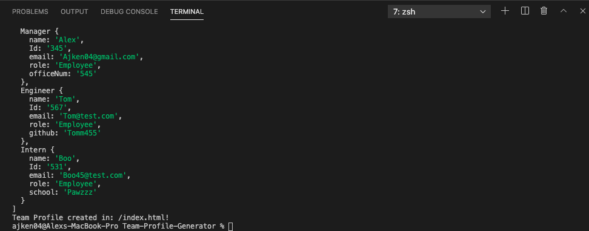
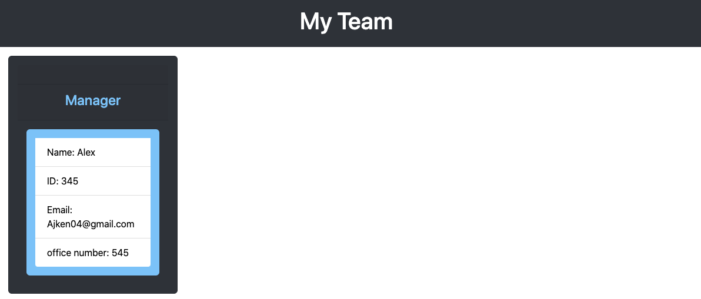
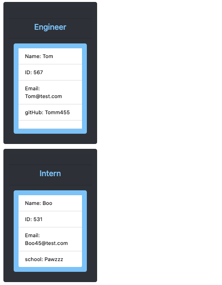

# Team-Profile-Generator

## Description 

A series of questions a manager can answer to create a team profile.

## User Story

AS A manager
I WANT to generate a webpage that displays my team's basic info
SO THAT I have quick access to their emails and GitHub profiles

## Acceptance Criteria

GIVEN a command-line application that accepts user input
WHEN I am prompted for my team members and their information
THEN an HTML file is generated that displays a nicely formatted team roster based on user input
WHEN I click on an email address in the HTML
THEN my default email program opens and populates the TO field of the email with the address
WHEN I click on the GitHub username
THEN that GitHub profile opens in a new tab
WHEN I start the application
THEN I am prompted to enter the team manager’s name, employee ID, email address, and office number
WHEN I enter the team manager’s name, employee ID, email address, and office number
THEN I am presented with a menu with the option to add an engineer or an intern or to finish building my team
WHEN I select the engineer option
THEN I am prompted to enter the engineer’s name, ID, email, and GitHub username, and I am taken back to the menu
WHEN I select the intern option
THEN I am prompted to enter the intern’s name, ID, email, and school, and I am taken back to the menu
WHEN I decide to finish building my team
THEN I exit the application, and the HTML is generated

## Usage
WHEN in the command line: run npm i
THEN run: node Team.js 

## Screen Shots 

## Project Link
Visit deployed project at:https://github.com/Aken00/Team-Profile-Generator

## Github Pages Link
https://aken00.github.io/Team-Profile-Generator/

## Video Link
Visit demo video at:https://drive.google.com/file/d/1OFGzOwHgxyYsH-m3fYQg2yVwWV2psAOI/view?usp=sharing

## Questions
  * Github Username: Aken00
  * [User Github](https://github.com/Aken00)
  * You can reach me at (ajken04@gmail.com)